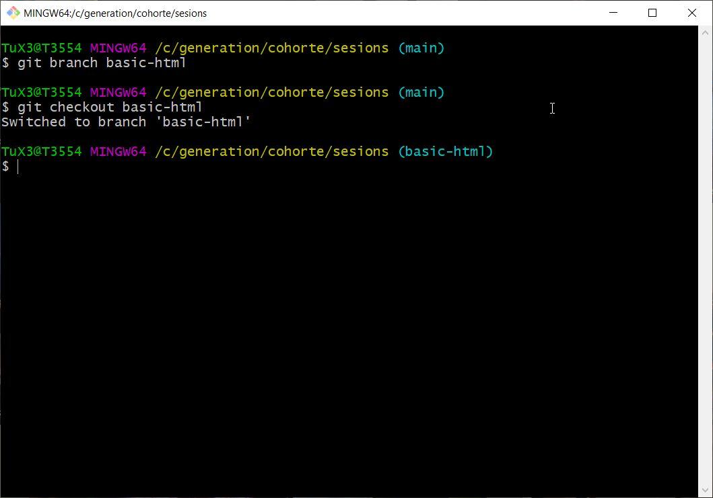
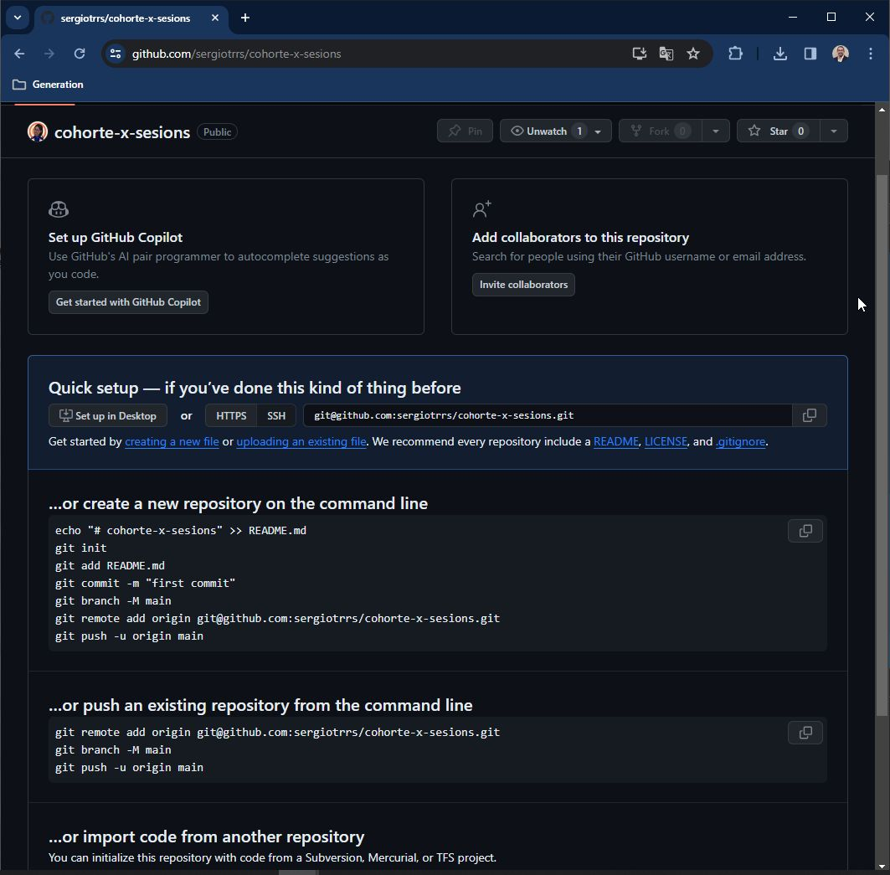

# Guía Práctica de Git: Domina los Comandos Esenciales

Esta guía te llevará paso a paso a través de los comandos más importantes de Git, desde la creación de un repositorio local hasta la sincronización con GitHub. Es ideal para desarrolladores que desean fortalecer su flujo de trabajo con Git y asegurar una colaboración eficiente en proyectos de software.

Este tutorial esta dividido en:

- **Inicializar un repositorio local** (`git init`)
- **Agregar archivos y realizar commits** (`git add`, `git commit`)
- **Gestionar ramas** (`git branch`)
- **Fusionar ramas** (`git merge`)
- **Conectar con un repositorio remoto** (`git remote`)
- **Subir cambios al repositorio remoto** (`git push`)
- **Verificar el historial de ramas** (`git log --all`)
- **Actualizar el repositorio local desde el remoto** (`git pull`)
- **Resolver conflictos durante la fusión de ramas**


Asegurate tener la configuración básica de git y estar autenticado con tu clave SSH:

- [Configuración básica git](Configuración_básica_git.md)
- [Uso de SSH con Git-GitHub](Uso_de_SSH_con_Git-GitHub.md)

## Inicializar un proyecto

Para realizar los siguientes ejercicios, es necesario tener un archivo o archivos en tu carpeta de trabajo. Si no tienes un proyecto existente, crea un archivo de ejemplo.

Crea 3 archivos en una carpeta donde comenzarás a generar tu proyecto web.

  ```bash
  touch index.html script.js style.css
  ```

<figure style="text-align:center">
  
</figure>

## Paso 1: Inicializar el repositorio.

`git init <nombre_del_directorio>`: Este comando inicializa un nuevo repositorio de Git en el directorio especificado o en el directorio actual si no se especifica uno.

- `<nombre_del_directorio>`: El nombre del directorio donde se creará el nuevo repositorio. Si omites este argumento, Git inicializará un repositorio en el directorio actual.

Este comando crea una carpeta oculta .git que contiene toda la información necesaria para el control de versiones.

  ```bash
  git init
  ```

<figure style="text-align:center">  
  
</figure>

`git branch -M <nombre_nueva_rama>`: Este comando renombra una rama existente, generalmente utilizada para cambiar el nombre de la rama por defecto.

- `<nombre_nueva_rama>`: El nombre que quieres asignar a la rama. En este caso, se renombra a "main", que es una convención común actualmente.

El uso de `-M` fuerza el cambio de nombre, sobrescribiendo cualquier rama existente con el mismo nombre.

  ```bash
  git branch -M main
  ```

<figure style="text-align:center">
  
</figure>

`git status`: Este comando muestra el estado actual del repositorio de Git, incluyendo:

- Archivos modificados que aún no se han añadido al área de preparación (staging).
- Archivos que están listos para ser confirmados (committed).
- Archivos no rastreados (untracked) que aún no están bajo control de versiones.

Es útil para revisar qué cambios se han hecho y qué acciones son necesarias antes de un commit.

  ```bash
  git status
  ```

<figure style="text-align:center">
  
</figure>

## Paso 2: Agregar archivos y realizar commits

`git add <ruta_archivo>`: Este comando añade cambios al área de preparación (staging area) para ser incluidos en el próximo commit.

- `<ruta_archivo>`: La ruta del archivo o directorio que deseas agregar. Puede ser un archivo específico, varios archivos o usar `.` para agregar todos los cambios en el directorio actual.

Este comando no realiza un commit, solo prepara los archivos para ser confirmados.

  ```bash
  git add .
  ```
  ```bash
  git status
  ```

<figure style="text-align:center">
  
</figure>

`git commit -m "<mensaje_commit>"` : Este comando guarda los cambios preparados en el historial del repositorio junto con un mensaje descriptivo.

- `<mensaje_commit>`: Es un texto que describe brevemente los cambios realizados en el commit. Debe ser claro y conciso para facilitar el seguimiento del historial de cambios.

El `-m` permite agregar el mensaje directamente desde la línea de comandos sin abrir el editor de texto.

  ```bash
  git commit -m "feat: add empty html, css, and js files"
  ```

<figure style="text-align:center">
  
</figure>

No existe una convención formal para el mensaje del commit, sin embargo, la [convención de Angular](https://github.com/angular/angular/blob/22b96b9/CONTRIBUTING.md#-commit-message-guidelines) para los commits es ampliamente utilizada porque ofrece beneficios claros en la gestión y mantenimiento de proyectos, y su adopción va más allá de Angular, aplicándose en diversos proyectos open-source y privados:

  ```
  <acción>(<área>): <mensaje breve>
  ```

- acción: Describe la naturaleza del commit (feat, fix, etc.).
- área: Opcional, describe la parte del proyecto que se está modificando.
- mensaje breve: Describe en pocas palabras qué se está haciendo.

Acciones comunes de commits:

- feat: Nueva funcionalidad o característica.
- fix: Corrección de errores.
- chore: Tareas que no afectan el código en sí (por ejemplo, actualizaciones de dependencias).
- docs: Cambios relacionados con la documentación.
- refactor: Modificaciones del código que no corrigen errores ni agregan nuevas funcionalidades.
- style: Cambios que no afectan la lógica del código (formato, espacios, etc.).
- test: Adición o actualización de pruebas.

GitHub recomienda que los commits sean lo más descriptivos posible, evitando mensajes genéricos como "actualización del código" o "arreglo del código". Esto facilita el rastreo de cambios en el proyecto.

GitHub fomenta la práctica de commits atómicos, es decir, que cada commit debe hacer una sola cosa (por ejemplo, agregar una función, corregir un error, etc.), lo que facilita la revisión y revertir cambios si es necesario.

Ejemplos de algunos commmits:
  ```
  feat(auth): add JWT authentication for secure login
  feat(auth): agregar autenticación JWT para inicio de sesión seguro

  refactor(userService): simplify user validation logic
  refactor(userService): simplificar la lógica de validación de usuarios

  style(button): add spaces between buttons
  style(button): agregar espacios entre botones
  ```

`git log`: Este comando muestra información detallada sobre la historia de confirmaciones(`commit`), incluyendo quién realizó cada confirmación, cuándo se hizo y un resumen de los cambios realizados.

    ```bash
    git log
    ```

<figure style="text-align:center">
  
</figure>

También puedes optar por usar con las sig. opciones:

- `git log --oneline`: Muestra cada confirmación en una sola línea con su identificador abreviado y el mensaje del commit.
- `git log --graph`: Muestra un gráfico ASCII que representa las relaciones entre las ramas y las confirmaciones.

<figure style="text-align:center">
  
</figure>

## Paso 3: Gestionar ramas

`git branch <nombre_rama>`: Este comando crea una nueva rama basada en la rama actual.

- `<nombre_rama>`: El nombre de la nueva rama que quieres crear. La rama nueva será una copia de la rama actual en el punto en que se encuentra.
Este comando no cambia a la nueva rama automáticamente, solo la crea.

  ```bash
  git branch basic-html
  ```

<figure style="text-align:center">
  
</figure>

`git checkout <nombre_rama>`: Este comando cambia a la rama especificada y actualiza los archivos en el directorio de trabajo a la última versión confirmada en esa rama.

- `<nombre_rama>`: El nombre de la rama a la que quieres cambiar. Si la rama existe, Git cambiará a ella; si no, Git lanzará un error.

  ```bash
  git checkout basic-html
  ```

<figure style="text-align:center">
  
</figure>

Abre el editor de tu preferencia y escribe la estructura html básica.

  ```html
  <!DOCTYPE html>
  <html lang="en">
  <head>
      <meta charset="UTF-8">
      <meta name="viewport" content="width=device-width, initial-scale=1.0">
      <title>Document</title>
  </head>
  <body>
      <h1>Hello World</h1>
  </body>
  </html>
  ```

<figure style="text-align:center">
  
</figure>

- Verificando el estado del repositorio

  ```bash
  git status
  ```

<figure style="text-align:center">
  
</figure>

- `git diff`: Este comando muestra las diferencias entre archivos en el directorio de trabajo y el área de preparación, o entre dos commits. Se puede incluir el nombre de un archivo en específico `git diff filename`.

  ```bash
  git diff index.html
  ```

<figure style="text-align:center">
  
</figure>

- `git add .`: agrega la modificación del archivo al área de preparación de Git (staging area).

    ```bash
    git add .
    ```

<figure style="text-align:center">
  
</figure>

- `git commit -m "verbo: mensaje"`: confirma los cambios realizando un `commit`.

    ```bash
    git commit -m "feat: basic HTML structure tags"
    ```

<figure style="text-align:center">
  
</figure>

- `git status`: información sobre el estado actual del repositorio.

  ```bash
  git status
  ```

<figure style="text-align:center">
  
</figure>

## Paso 4: Fusionar ramas.

Una vez que hayas terminado de desarrollar la funcionalidad en la nueva rama, puedes fusionar los cambios con otra rama, en este caso, la rama `main`. Para realizar la fusión, primero debes cambiar a la rama que recibirá los cambios:

  ```bash
  git checkout main
  ```

<figure style="text-align:center">
  
</figure>

`git merge <nombre_rama>`: Este comando combina los cambios de la rama especificada(`basic-html`) en la rama actual(`main`).

- `<nombre_rama>`: La rama que quieres fusionar en la rama en la que estás trabajando actualmente. Git integrará los cambios de <nombre_rama> en tu rama actual.

Este comando puede generar conflictos si los cambios en ambas ramas afectan las mismas líneas de código; en tal caso, deberás resolver los conflictos manualmente antes de completar el merge.

  ```bash
  git merge basic-html    
  ```

<figure style="text-align:center">
  
</figure>

  ```bash
  git status
  ```

<figure style="text-align:center">
  
</figure>

## Paso 5: Verificar la conexión remota

Crea un respositorio nuevo en GitHub. 
Se recomienda tener configurada la llave pública para realizar la conexión con la dirección SSH. Si no tienes la configuración revisa la sección [Uso de SSH con Git-GitHub](Uso_de_SSH_con_Git-GitHub.md)

<figure style="text-align:center">
  
</figure>

- Copia la direcció SSH del nuevo repositorio.

<figure style="text-align:center">
  
</figure>

`git remote add <nombre_remoto> <URL_del_repositorio>`: Este comando agrega una nueva dirección remota a un repositorio Git existente. Puedes hacer la configuración desde cualquier rama.

- `<nombre_remoto>`: Esto es un nombre descriptivo que le das a la dirección remota. Por convención, "origin" es el nombre más comúnmente utilizado, pero puedes elegir cualquier nombre que tenga sentido para ti. El nombre se utiliza posteriormente para referirse a la dirección remota en otros comandos Git.

- `<URL_del_repositorio>`: Aquí debes proporcionar la URL del repositorio remoto al que deseas conectarte. La URL puede ser una dirección HTTP/HTTPS o una dirección SSH, dependiendo de cómo esté configurado el repositorio remoto.

  ```bash
  git remote add origin git@github.com:usergithub/cohorte-x-sesions.git
  ```

<figure style="text-align:center">
  
</figure>

- `git remote`: Se utiliza en Git para mostrar una lista de las direcciones remotas (remotes) configuradas en un repositorio Git junto con sus URL asociadas. 
- `git remote -v`: La opción -v o --verbose muestra información detallada sobre cada una de las direcciones remotas.

    ```bash
    git remote -v
    ```

<figure style="text-align:center">
  
</figure>

## Paso 5: Subir cambios al repositorio remoto

`git push origin main`: Este comando se utiliza en Git para enviar (subir) tus cambios locales en la rama `main` de tu repositorio local al repositorio remoto (GitHub) denominado "origin".

- `origin`: El nombre del repositorio remoto. Por convención, `origin` es el nombre predeterminado para el repositorio remoto original, pero puedes tener otros remotos con diferentes nombres.
- `main`: La rama local que deseas enviar al remoto.

    ```bash
    git push origin main
    ```

<figure style="text-align:center">
  
</figure> 

- Si deseas subir otra rama tendrás que idicarla `git push origin basic-html`.

Verificar los cambios en GitHub en la rama main.

<figure style="text-align:center">
  
</figure>

- Puedes trabajar en otra rama y hacer merge a tu rama main, posteriormente hacer de nueva `git push origin main`. Puedes hacer varios `commits` y al final un solo `git push`.

## Paso 7: Verificar el historial de ramas

`git log --oneline --graph --all`: Obtendrás una vista gráfica de la historia de confirmaciones de tu repositorio que incluye todas las ramas. Esto te permite ver de un vistazo cómo se desarrolla el proyecto, dónde se realizan fusiones y bifurcaciones, y cuáles son las confirmaciones más recientes.

  ```bash
  git log --oneline --graph --all
  ```

- En Git, la rama que contiene la referencia especial `HEAD` indica la rama actual en la que te encuentras trabajando. `HEAD` es un puntero que apunta al último commit de la rama actual, y por lo tanto, representa la posición actual en la historia de confirmaciones del repositorio.

<figure style="text-align:center">
  
</figure>

La imagen anterior nos muestra que tienes dos ramas locales: `main` y `basic-html` que están al mismo nivel de historia, es decir, están sincronizadas en el commit 093a21a. 

Por otro lado, `origin/main` indica una rama remota llamada `main` en el repositorio remoto que está configurado como `origin`. La rama `origin/main` rastrea la versión de `main` en el repositorio remoto. Puedes sincronizar tus cambios locales con esta rama remota mediante comandos como `git push` o `git pull`.

## Paso 8: Actualizar el repositorio local desde el remoto

En GitHub abre el archivo index.html dandole clic.

<figure style="text-align:center">
  
</figure>

- Pulsa el ícono de lapiz para editar el documento y agrega nueva información.
<figure style="text-align:center">
  
</figure>  

- Pulsa el botón `Commit changes...` para realizar un commit. Se recomienda seguir con el mismo formato que estés usando en tus commits locales. Para finalizar pulsa el botón `Commit changes`.

<figure style="text-align:center">
  
</figure>

Regresa a tu repositorio local y situate en la rama `main`, utiliza `git log --oneline --graph --all` para obtener una vista gráfica de la historia de confirmaciones de tu repositorio.

  ```bash
  git log --oneline --graph --all
  ```
<figure style="text-align:center">
  
</figure>

`git fetch origin main`: Este comando se utiliza en Git para recuperar los cambios de la rama main del repositorio remoto llamado `origin`` sin fusionar automáticamente estos cambios con tu rama local. 

- `origin`: El nombre del repositorio remoto del que estás obteniendo los cambios.
- `main`: La rama en el repositorio remoto que deseas descargar.

`git fetch` solo actualiza tu repositorio local con los datos del remoto, sin modificar tu rama actual. Para integrar esos cambios, debes usar `git merge` o `git rebase`.

  ```bash
  git fetch origin main
  ```

<figure style="text-align:center">
  
</figure> 

- Puedes verificar con `git log --oneline --graph --all` el estado de las ramas locales y remotas. En la siguiete imagen se muestra que la rama remota `origin/main` tiene un commit (ae1a138) más en la historia que la rama local `main` (093a21a).

    ```bash
    git log --oneline --graph --all
    ```

<figure style="text-align:center">
  
</figure> 

`git merge origin/main`: Este comando fusiona los cambios de la rama main del repositorio remoto origin en tu rama local actual.

- `origin/main`: La referencia a la rama main en el repositorio remoto origin.

Este comando integra los cambios descargados de `origin/main` en tu rama local actual, actualizando tu rama con los últimos cambios del repositorio remoto. Si hay conflictos, tendrás que resolverlos antes de completar el merge.

  ```bash
  git merge origin/main
  ```

<figure style="text-align:center">
  
</figure>

- Puedes verificar con `git log --oneline --graph --all` el estado de las ramas locales y remotas.

<figure style="text-align:center">
  
</figure> 
 
Una alternativa de `git fetch` y `git merge` es usar  `git pull <nombre_remoto> <nombre_rama_remota>`: Este comando se utiliza en Git para recuperar (fetch) los cambios de la rama main del repositorio remoto llamado `origin` y fusionar (merge) automáticamente esos cambios con tu rama local. 

  ```bash
  git pull origin main
  ```

## Resolver conflictos durante la fusión de ramas

Si otros colaboradores han realizado cambios en el repositorio remoto en las mismas líneas de código que tú has modificado localmente, podrías enfrentar conflictos de fusión. Al hacer un git pull, tendrás la oportunidad de resolver los conflictos de manera proactiva antes de enviar tus cambios. Esto facilita la gestión de conflictos, ya que puedes resolverlos localmente antes de confirmar tus cambios.

En el siguiente ejercicio se modificará la misma línea en el archivo index.html localmente y en GitHub, posteriomente en tu repositorio local se realizará `git pull` por lo que git indicará que hay un conflicto en el archivo.

Modificar localmente el archivo index.html cambiando el contenido de la etiqueta h1 a "Generation Mx". Guarda los cambios.

<figure style="text-align:center">
  
</figure> 

- Agrega las modificaciones al área de preparación con `git add .` y confirma los cambios con `git commit`.

Modifica el archivo index.html desde GitHub cambiando el contenido de la etiqueta h1 a "HTML, JS, CS".

<figure style="text-align:center">
  
</figure> 
<figure style="text-align:center">
  
</figure> 

`git pull <nombre_remoto> <nombre_rama_remota>`: Este comando se utiliza en Git para recuperar (fetch) los cambios de la rama main del repositorio remoto llamado `origin` y fusionar (merge) automáticamente esos cambios con tu rama local. 

  ```bash
  git pull origin main
  ```

<figure style="text-align:center">
  
</figure> 

Cuando en Git ves que una rama aparece con el formato `main|MARGIN`, eso generalmente significa que la rama en la que te encuentras (en este caso, "main") tiene cambios pendientes (commits) que aún no se han enviado (push) al repositorio remoto.

- Puedes ejecutar `git status` para conocer el estado de tu repositorio. El mensaje "You have unmerged paths" en Git significa que tienes conflictos de fusión sin resolver en tu repositorio. Esto ocurre cuando Git no puede fusionar automáticamente dos ramas debido a cambios conflictivos en el mismo archivo o línea de código.

  ```bash
  git status
  ```

<figure style="text-align:center">
  
</figure> 

Abre el archivo `index.html` y se mostrará 

    ```html
    <<<<<< HEAD
     cambios locales 
    ========
     cambios remotos
    >>>>> HASH de Commit
    ```

<figure style="text-align:center">
  
</figure>  

- Realiza las modificaciones adecuadas eliminado, uniendo o agregando elementos, esto lo puedes realizar manualmente, no olvides quitar los decoradores `<<< === >>> `. Algunos IDEs te ayudan a realizar el cambio pulsando las opciones "Accept Current Changes", "Accept Incoming Cahnge", "Accept Both Changes".

<figure style="text-align:center">
  
</figure> 

Agrega y confirma tus cambios con `git add .` y `git commit -m `. 

<figure style="text-align:center">
  
</figure>  

Sube tus cambios locales a tu repositorio remoto con `git push`.

<figure style="text-align:center">
  
</figure> 

Se recomienda hacer `git pull` antes de `git push`. Esto asegura que tu rama local esté actualizada con los últimos cambios del repositorio remoto antes de subir tus propios cambios. Al hacer `git pull`, Git descarga y fusiona los cambios remotos en tu rama local, lo que ayuda a evitar conflictos y asegura que tu historial de commits esté alineado con el repositorio remoto.