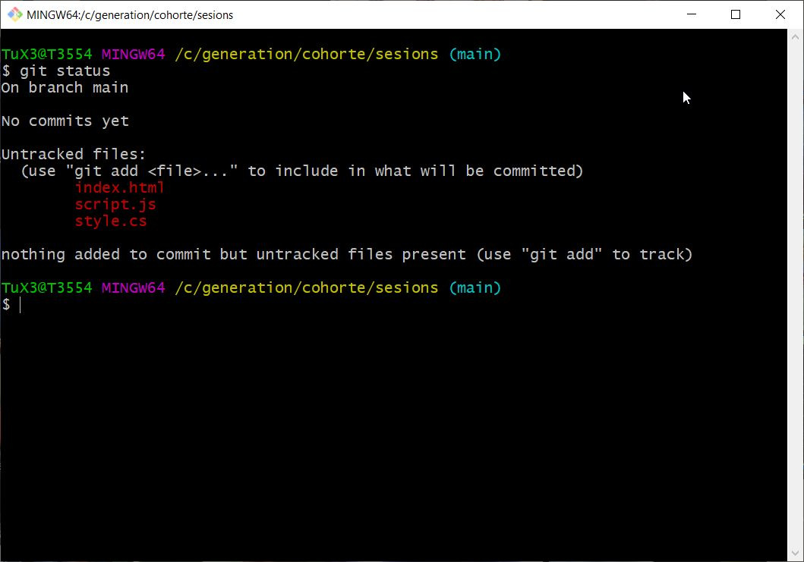
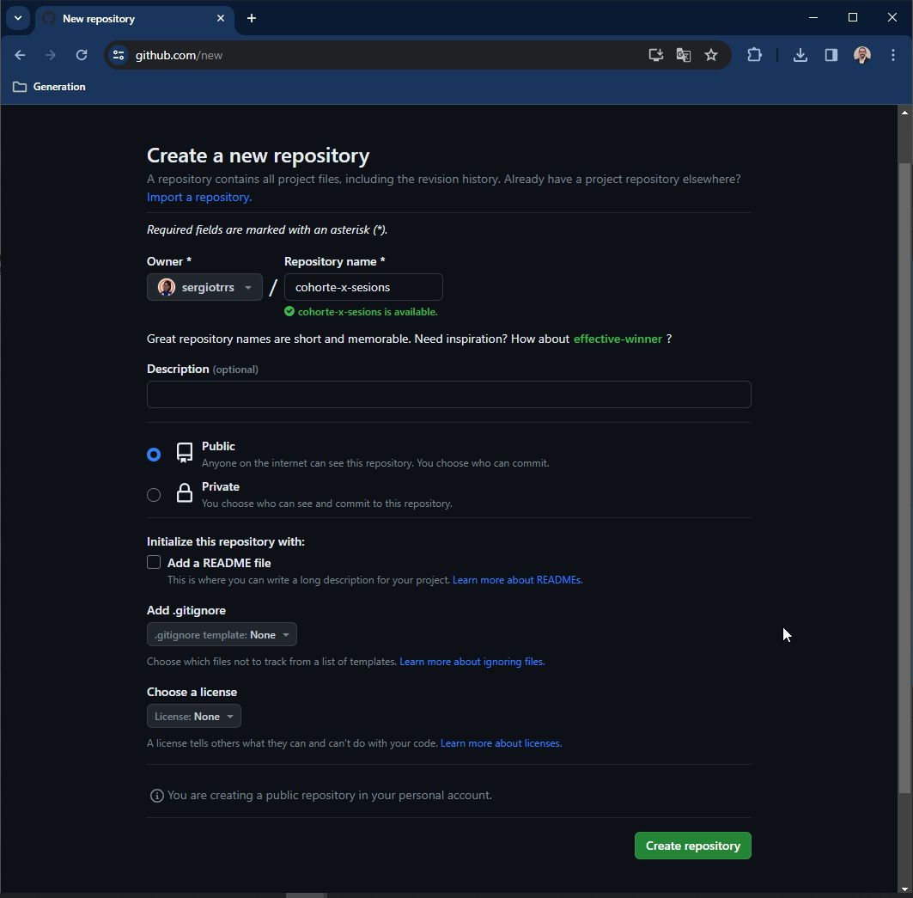
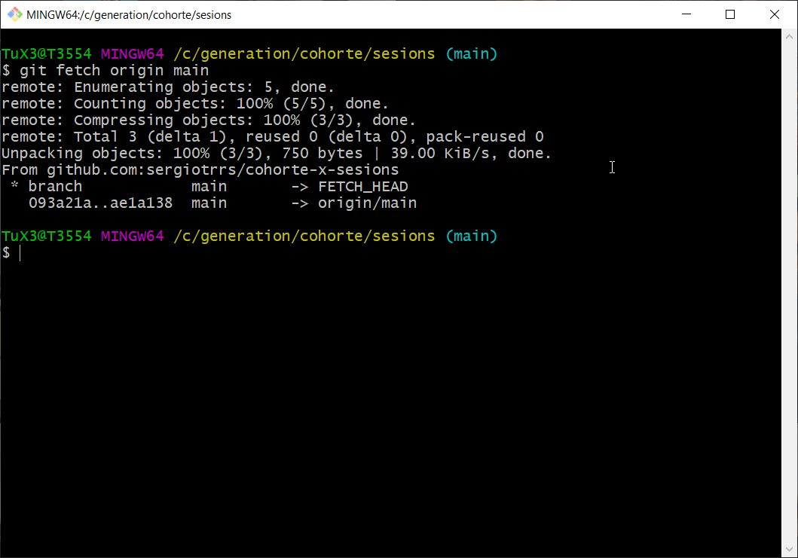
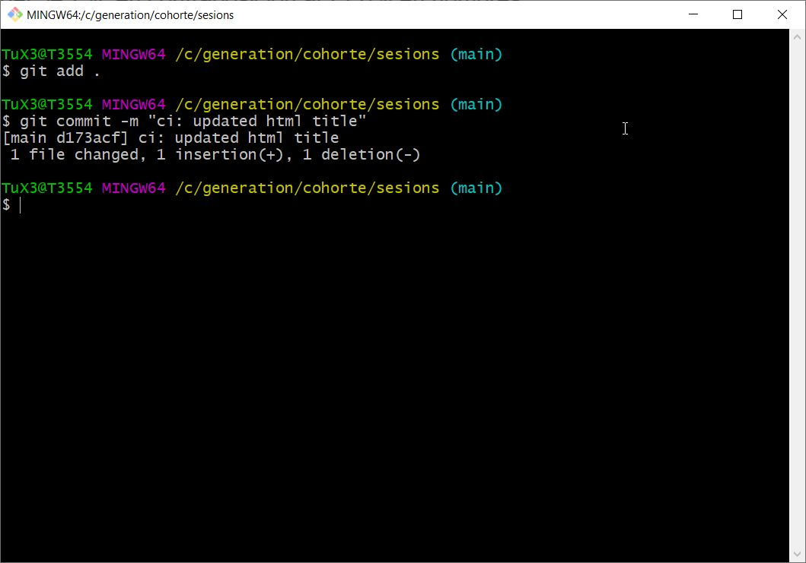

# Instrucciones de Git

A continuación se describen algunas de las instrucciones más comunes de Git, desde el comienzo de un proyecto.

## Crear un repositorio local.

1. `git init`: Este comando se utiliza para inicializar un nuevo repositorio Git en el directorio actual.

    ```bash
    git init
    ```
<div style="text-align:center">
  
  
</div>

2. `git branch -M main`: Este comando se utiliza para renombrar la rama actual a "main".

    ```bash
    git branch -M main
    ```
<div style="text-align:center">
  
</div>

3. `git status`: Este comando muestra el estado del repositorio Git, incluyendo los cambios que están en el área de preparación pero aún no han sido confirmados.

    ```bash
    git status
    ```
<div style="text-align:center">
  
</div>

## Agregar archivos al repositorio.

4. `git add .`: Este comando agrega todos los archivos y directorios del directorio actual al área de preparación de Git, preparándolos para el próximo commit.

    ```bash
    git add .
    git status
    ```
<div style="text-align:center">
  
</div>

5. `git commit -m "add: empty html, css, and js files"`: Este comando realiza un commit con todos los cambios que están en el área de preparación, se recomiendo utilizar el formato "verbo: descripción" como mensaje del commit.

    ```bash
    git commit -m "add: empty html, css, and js files"
    ```
<div style="text-align:center">
  
</div>

6. `git log`: Este comando muestra información detallada sobre la historia de confirmaciones, incluyendo quién realizó cada confirmación, cuándo se hizo y un resumen de los cambios realizados.

    ```bash
    git log
    ```

<div style="text-align:center">
  
</div>

También puedes optar por usar con las sig. opciones:
- `git log --oneline`: Muestra cada confirmación en una sola línea con su identificador abreviado y el mensaje del commit.
Ver un gráfico de ramas:

- `git log --graph`: Muestra un gráfico ASCII que representa las relaciones entre las ramas y las confirmaciones.

<div style="text-align:center">
  
</div>

## Crear ramas.

7. `git branch newFeature`: Este comando crea una nueva rama llamada "newFeature".

    ```bash
    git branch basic-html
    ```
<div style="text-align:center">
  
</div>

8. `git checkout basic-html`: Este comando cambia a la rama "newFeature".

    ```bash
    git checkout basic-html
    ```
<div style="text-align:center">
  
</div>

9. `git add .` y `git commit `: Estos comandos agregan todos los cambios al área de preparación y luego realizan un commit con el mensaje "verbo: descripción". Estos mismo comandos se repetirá por cada avance significativo que realices en tu proyecto.

    ```bash
    git add .
    git commit -m "feat: basic HTML structure tags"
    ```
- Creando la estructura básica del archivo html.
<div style="text-align:center">
  
</div>

- Verificando el estado del repositorio
<div style="text-align:center">
  
</div>

- `git diff`: ver las diferencias entre el área de trabajo y el área de preparación. Se puede incluir el nombre de un archivo en específico `git diff filename`.
<div style="text-align:center">
  
</div>

- `git add .`: agrega la modificación del archivo al área de preparación de Git (staging area).
<div style="text-align:center">
  
</div>

- `git commit -m "verbo: mensaje"`: realiza un commit con el cambio realizado.
<div style="text-align:center">
  
</div>

- `git status`: información sobre el estado actual del repositorio.
<div style="text-align:center">
  
</div>

## Fusionar ramas.

10. `git checkout main`: Este comando cambia de nuevo a la rama "main".

    ```bash
    git checkout main
    ```

<div style="text-align:center">
  
</div>

11. `git merge newFeature`: Este comando fusiona los cambios de la rama "newFeature" en la rama actual (en este caso, "main").

    ```bash
    git merge basic-html
    git status
    ```

<div style="text-align:center">
  
</div>
<div style="text-align:center">
  
</div>

## Agregar una dirección remota a un repositorio Git existente

12. Crear un respositorio nuevo en GitHub. 
Se recomienda tener configurada la llave pública para realizar la conexión con la dirección SSH. Si no tienes la configuración revisa la sección "Generar llave pública".

<div style="text-align:center">
  
</div>

- Copia la direcció SSH del nuevo repositorio.

<div style="text-align:center">
  
</div>

13. `git remote add <nombre_remoto> <URL_del_repositorio>`: Este comando agrega una nueva dirección remota a un repositorio Git existente. Puedes hacer la configuración desde cualquier rama.

- `<nombre_remoto>`: Esto es un nombre descriptivo que le das a la dirección remota. Por convención, "origin" es el nombre más comúnmente utilizado, pero puedes elegir cualquier nombre que tenga sentido para ti. El nombre se utiliza posteriormente para referirse a la dirección remota en otros comandos Git.

- `<URL_del_repositorio>`: Aquí debes proporcionar la URL del repositorio remoto al que deseas conectarte. La URL puede ser una dirección HTTP/HTTPS o una dirección SSH, dependiendo de cómo esté configurado el repositorio remoto.

    ```bash
    git remote add origin git@github.com:usergithub/cohorte-x-sesions.git
    ```

<div style="text-align:center">
  
</div>

- `git remote`: Se utiliza en Git para mostrar una lista de las direcciones remotas (remotes) configuradas en un repositorio Git junto con sus URL asociadas. 
- `git remote -v`: La opción -v o --verbose muestra información detallada sobre cada una de las direcciones remotas.

    ```bash
    git remote -v
    ```

<div style="text-align:center">
  
</div>

## Subir cambios locales a GitHub.

14. `git push origin main`: Este comando se utiliza en Git para enviar (subir) tus cambios locales en la rama main de tu repositorio local al repositorio remoto (GitHub) denominado "origin".

    ```bash
    git push origin main
    ```

<div style="text-align:center">
  
</div> 

- Si deseas subir otra rama tendrás que idicarla `git push origin basic-html`.

15. Verificar los cambios en GitHub en la rama main.

<div style="text-align:center">
  
</div>

- Puedes trabajar en otra rama y hacer merge a tu rama main, posteriormente hacer de nueva `git push origin main`. Puedes hacer varios `commits` y al final un solo `git push`.

## Conocer el estado de las ramas locales y remotas.

16. `git log --oneline --graph --all`: Obtendrás una vista gráfica de la historia de confirmaciones de tu repositorio que incluye todas las ramas. Esto te permite ver de un vistazo cómo se desarrolla el proyecto, dónde se realizan fusiones y bifurcaciones, y cuáles son las confirmaciones más recientes.

    ```bash
    git log --oneline --graph --all
    ```
- En Git, la rama que contiene la referencia especial `HEAD` indica la rama actual en la que te encuentras trabajando. `HEAD` es un puntero que apunta al último commit de la rama actual, y por lo tanto, representa la posición actual en la historia de confirmaciones del repositorio.

<div style="text-align:center">
  
</div>

La imagen anterior nos muestra que tienes dos ramas locales: `main` y `basic-html` que están al mismo nivel de historia, es decir, están sincronizadas en el commit 093a21a. 

Por otro lado, `origin/main` indica una rama remota llamada `main` en el repositorio remoto que está configurado como `origin`. La rama `origin/main` rastrea la versión de `main` en el repositorio remoto. Puedes sincronizar tus cambios locales con esta rama remota mediante comandos como `git push` o `git pull`.

## Recuperar cambios de un repositorio remoto.

17. En GitHub abre el archivo index.html dandole clic.

<div style="text-align:center">
  
</div>

- Pulsa el ícono de lapiz para editar el documento y agrega nueva información.
<div style="text-align:center">
  
</div>  

- Pulsa el botón `Commit changes...` para realizar un commit. Se recomienda seguir con el mismo formato que estés usando en tus commits locales. Para finalizar pulsa el botón `Commit changes`.

<div style="text-align:center">
  
</div>

18. Regresa a tu repositorio local y situate en la rama `main`, utiliza `git log --oneline --graph --all` para obtener una vista gráfica de la historia de confirmaciones de tu repositorio.

    ```bash
    git log --oneline --graph --all
    ```
<div style="text-align:center">
  
</div>

19. `git fetch origin main`: Este comando se utiliza en Git para recuperar los cambios de la rama main del repositorio remoto llamado `origin`` sin fusionar automáticamente estos cambios con tu rama local. 

    ```bash
    git fetch origin main
    ```
<div style="text-align:center">
  
</div> 

- Puedes verificar con `git log --oneline --graph --all` el estado de las ramas locales y remotas. En la siguiete imagen se muestra que la rama remota `origin/main` tiene un commit (ae1a138) más en la historia que la rama local `main` (093a21a).

    ```bash
    git log --oneline --graph --all
    ```

<div style="text-align:center">
  
</div> 

20. `git merge origin/main`: Este comando se utiliza para fusionar los cambios de la rama remota main en el repositorio remoto "origin" en tu rama local actual. Es importante tener en cuenta que antes de ejecutar `git merge origin/main`, es recomendable asegurarse de que tu rama local esté limpia, es decir, no tenga cambios sin confirmar, para evitar conflictos durante la fusión.

    ```bash
    git merge origin/main
    ```
<div style="text-align:center">
  
</div>

- Puedes verificar con `git log --oneline --graph --all` el estado de las ramas locales y remotas.

<div style="text-align:center">
  
</div> 
 
21. Una alternativa de `git fetch` y `git merge` es usar  `git pull <nombre_remoto> <nombre_rama_remota>`: Este comando se utiliza en Git para recuperar (fetch) los cambios de la rama main del repositorio remoto llamado "origin" y fusionar (merge) automáticamente esos cambios con tu rama local. 

    ```bash
    git pull origin main
    ```

## Resolución de conflictos en la fusión de ramas.

Si otros colaboradores han realizado cambios en el repositorio remoto en las mismas líneas de código que tú has modificado localmente, podrías enfrentar conflictos de fusión. Al hacer un git pull, tendrás la oportunidad de resolver los conflictos de manera proactiva antes de enviar tus cambios. Esto facilita la gestión de conflictos, ya que puedes resolverlos localmente antes de confirmar tus cambios.

En el siguiente ejercicio se modificará la misma línea en el archivo index.html localmente y en GitHub, posteriomente en tu repositorio local se realizará `git pull` por lo que git indicará que hay un conflicto en el archivo.

22. Modificar localmente el archivo index.html cambiando el contenido de la etiqueta h1 a "Generation Mx". Guarda los cambios.

<div style="text-align:center">
  
</div> 

- Agrega las modificaciones al área de preparación con `git add .` y confirma los cambios con `git commit`.

23. Modifica el archivo index.html desde GitHub cambiando el contenido de la etiqueta h1 a "HTML, JS, CS".

<div style="text-align:center">
  
</div> 
<div style="text-align:center">
  
</div> 

24. `git pull <nombre_remoto> <nombre_rama_remota>`: Este comando se utiliza en Git para recuperar (fetch) los cambios de la rama main del repositorio remoto llamado "origin" y fusionar (merge) automáticamente esos cambios con tu rama local. 

    ```bash
    git pull origin main
    ```
<div style="text-align:center">
  
</div> 

Cuando en Git ves que una rama aparece con el formato `main|MARGIN`, eso generalmente significa que la rama en la que te encuentras (en este caso, "main") tiene cambios pendientes (commits) que aún no se han enviado (push) al repositorio remoto.

- Puedes ejecutar `git status` para conocer el estado de tu repositorio. El mensaje "You have unmerged paths" en Git significa que tienes conflictos de fusión sin resolver en tu repositorio. Esto ocurre cuando Git no puede fusionar automáticamente dos ramas debido a cambios conflictivos en el mismo archivo o línea de código.

    ```bash
    git status
    ```
<div style="text-align:center">
  
</div> 

25. Abre el archivo `index.html` y se mostrará 

    ```html
    <<<<<< HEAD
     cambios locales 
    ========
     cambios remotos
    >>>>> HASH de Commit
    ```

<div style="text-align:center">
  
</div>  

- Realiza las modificaciones adecuadas eliminado, uniendo o agregando elementos, esto lo puedes realizar manualmente, no olvides quitar los decoradores `<<< === >>> `. Algunos IDEs te ayudan a realizar el cambio pulsando las opciones "Accept Current Changes", "Accept Incoming Cahnge", "Accept Both Changes".

<div style="text-align:center">
  
</div> 

26. Agrega y confirma tus cambios con `git add .` y `git commit -m `. 

<div style="text-align:center">
  
</div>  

27. Sube tus cambios locales a tu repositorio remoto con `git push`.

<div style="text-align:center">
  
</div> 